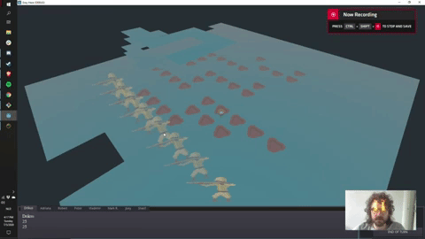
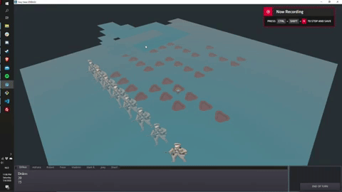
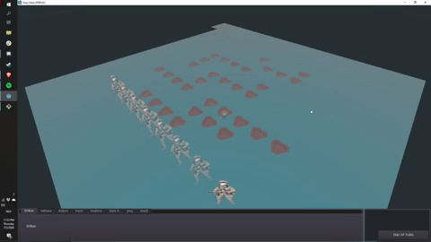
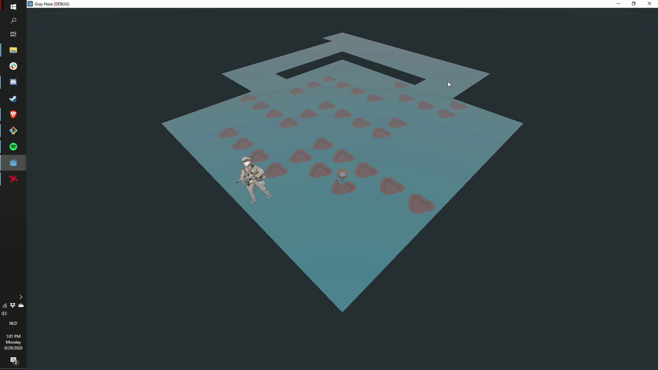

# Gray Haze

## Progress

## Update 2020-07-06

Fifth update here. Added camera movement with arrow keys. Added enemies and paved the way for adding AI. Maybe I'm not such a noob after all.

## Update 2020-07-05

Fourth update here. Whenever a user gets selected, its planned path gets recalculated.

## Update 2020-07-04

Third update here. Calculation of path now takes into account the position of other players and their respective target positions (the place they would like to move to). Also, the max amount of steps a player can take is now determined by the action point it has. Later, these action points will be reset after each and every round. Not bad if I can say so myself. In fact, it is quite the milestone for the noob I am.

## Update 2020-07-02

Second update here. I have a basic UI with tabs that are synchronized with player selection. It seems to quite alright, it is quite the milestone for the noob I am.

### Update 2020-06-29

First update here. I have been able to making path finding work. Although not perfect, it is quite the milestone for the noob I am.

